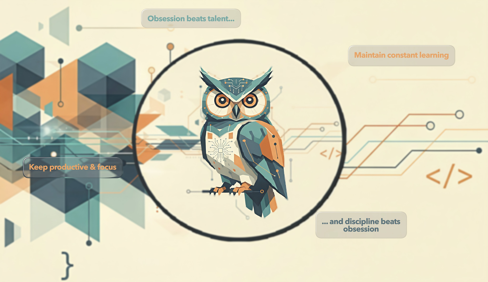

 Jessica R. Dórame G.

Welcome to my profile! I'm still a student, also learning on my own...

  <h2>🌐 My social media </h2>
  
Stay in touch with me, follow me on my journey to becoming a professional!

  
| Instagram | X / Twitter |
|:---------:|:-----------:|
|  **Instagram** @floatycoder |  **X** @floatycoder |

<h2 align="center" style="color:rgb(120, 171, 161); font-size:14px; font-weight:bold;">
 ABOUT ME
</h2>

I'm a Software Engineering student. Currently, my training focuses primarily on Java, although I've also worked with Python and previously studied C# at another university. I've continued learning and practicing these languages ​​independently, developing personal desktop projects. I have a great curiosity for development and other areas of technology, and I have big plans for my future in technology!

<h2 align="left"style="color:rgb(120, 171, 161); font-size:14px; font-weight:bold;">
 ¿WHAT AM I DOING NOW?
</h2>

- Developing Personal Desktop projects - Finishing my developer degree - Taking a Front-End course

<h2></h2>
<h2 align="center"style="color:rgb(124, 173, 165); font-size:20px; font-weight:bold;">
 TECH STACK
</h2>

| **Programming languages** |   **Data bases**   |    **Tools / Technologies**   |    **Learning now**   |
|:-----: | :-----: |  :-----:  |:-----:  |
| 
     
| 
    
 | 
     
|
   

<h2 align="center"style="color:rgb(124, 173, 165); font-size:20px; font-weight:bold;">
 MY GITHUB STATS
</h2>

 
  
   
   
 

<table>
  <tr>
    <td>
      
    </td>
    <td>
      
    </td>
    <td>
      
    </td>
  </tr>
</table>

